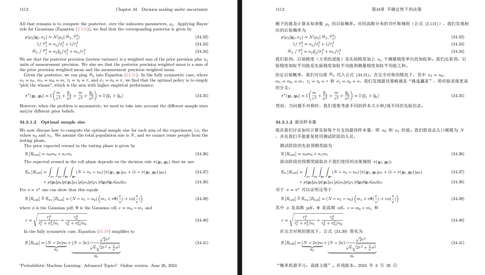

<h2 id="title">BilingualPDF</h2>

  <!-- PyPI -->
  
  
  
  <!--  -->
  <!--  -->
  <!-- <a href="https://www.modelscope.cn/studios/AI-ModelScope/BilingualPDF"> -->
    <!-- </a> -->
  <!--  -->
    </a>
  <!-- License -->
  
    

PDF scientific paper translation and bilingual comparison. Based on [BabelDOC](https://github.com/funstory-ai/BabelDOC). Additionally, this project is also the official reference implementation for calling BabelDOC to perform PDF translation.

- 📊 Preserve formulas, charts, table of contents, and annotations _([preview](#preview))_.
- 🌐 Support [multiple languages](https://openx123.github.io/BilingualPDF/supported_languages.html), and diverse [translation services](https://openx123.github.io/BilingualPDF/advanced/Documentation-of-Translation-Services.html).
- 🤖 Provides [commandline tool](https://openx123.github.io/BilingualPDF/getting-started/USAGE_commandline.html), [interactive user interface](https://openx123.github.io/BilingualPDF/getting-started/USAGE_webui.html), and [Docker](https://openx123.github.io/BilingualPDF/getting-started/INSTALLATION_docker.html)

The public WebUI uses a React client backed by FastAPI job APIs. Run `npm ci && npm run build` in `frontend/` when changing the interface. The legacy Gradio interface is available at `/legacy` only when `BILINGUALPDF_ENABLE_LEGACY=1` is set.

> [!WARNING]
>
> This project is provided "as is" under the [AGPL v3](https://github.com/OpenX123/BilingualPDF/blob/main/LICENSE) license, and no guarantees are provided for the quality and performance of the program. **The entire risk of the program's quality and performance is borne by you.** If the program is found to be defective, you will be responsible for all necessary service, repair, or correction costs.
>
> Due to the maintainers' limited energy, we do not provide any form of usage assistance or problem-solving. Related issues will be closed directly! (Pull requests to improve project documentation are welcome; bugs or friendly issues that follow the issue template are not affected by this)

For details on how to contribute, please consult the [Contribution Guide](https://openx123.github.io/BilingualPDF/community/Contribution-Guide.html).

<h2 id="preview">Preview</h2>

<!--  -->

<h2 id="demo">Online Service 🌟</h2>

You can try our application out using either of the following services:

- [Immersive Translate - BabelDOC](https://app.immersivetranslate.com/babel-doc/) Free usage quota is available; please refer to the FAQ section on the page for details.

<h2 id="install">Installation and Usage</h2>

### Installation

1. [**Windows EXE**](https://openx123.github.io/BilingualPDF/getting-started/INSTALLATION_winexe.html) <small>Recommand for Windows</small>
2. [**Docker**](https://openx123.github.io/BilingualPDF/getting-started/INSTALLATION_docker.html) <small>Recommand for Linux</small>
3. [**uv** (a Python package manager)](https://openx123.github.io/BilingualPDF/getting-started/INSTALLATION_uv.html) <small>Recommand for macOS</small>

---

### Usage

1. [Using **WebUI**](https://openx123.github.io/BilingualPDF/getting-started/USAGE_webui.html)
2. [Using **Zotero Plugin**](https://github.com/guaguastandup/zotero-pdf2zh) (Third party program)
3. [Using **Commandline**](https://openx123.github.io/BilingualPDF/getting-started/USAGE_commandline.html)

For different use cases, we provide distinct methods to use our program. Check out [this page](./getting-started/getting-started.md) for more information.

<h2 id="usage">Advanced Options</h2>

For detailed explanations, please refer to our document about [Advanced Usage](https://openx123.github.io/BilingualPDF/advanced/advanced.html) for a full list of each option.

<h2 id="downstream">Secondary Development (APIs)</h2>

<!-- <!-- For downstream applications, please refer to our document about [API Details](./docs/APIS.md) for futher information about: -->

- [Python API](./docs/en/advanced/API/python.md), how to use the program in other Python programs
<!-- - [HTTP API](./docs/APIS.md#api-http), how to communicate with a server with the program installed -->

<h2 id="langcode">Language Code</h2>

If you don't know what code to use to translate to the language you need, check out [this documentation](https://openx123.github.io/BilingualPDF/advanced/Language-Codes.html)

<h2 id="acknowledgement">Acknowledgements</h2>

- [Immersive Translation](https://immersivetranslate.com) sponsors monthly Pro membership redemption codes for active contributors to this project, see details at: [CONTRIBUTOR_REWARD.md](https://github.com/funstory-ai/BabelDOC/blob/main/docs/CONTRIBUTOR_REWARD.md)

- [SiliconFlow](https://siliconflow.cn) provides a free translation service for this project, powered by large language models (LLMs).

- 1.x version: [Byaidu/BilingualPDF](https://github.com/Byaidu/BilingualPDF)

- backend: [BabelDOC](https://github.com/funstory-ai/BabelDOC)

- PDF Library: [PyMuPDF](https://github.com/pymupdf/PyMuPDF)

- PDF Parsing: [Pdfminer.six](https://github.com/pdfminer/pdfminer.six)

- PDF Preview: [Gradio PDF](https://github.com/freddyaboulton/gradio-pdf)

- Layout Parsing: [DocLayout-YOLO](https://github.com/opendatalab/DocLayout-YOLO)

- PDF Standards: [PDF Explained](https://zxyle.github.io/PDF-Explained/), [PDF Cheat Sheets](https://pdfa.org/resource/pdf-cheat-sheets/)

- Multilingual Font: see [BabelDOC-Assets](https://github.com/funstory-ai/BabelDOC-Assets)

- [Asynchronize](https://github.com/multimeric/Asynchronize/tree/master?tab=readme-ov-file)

- [Rich logging with multiprocessing](https://github.com/SebastianGrans/Rich-multiprocess-logging/tree/main)

<h2 id="conduct">Before submit your code</h2>

We welcome the active participation of contributors to make pdf2zh better. Before you are ready to submit your code, please refer to our [Code of Conduct](https://openx123.github.io/BilingualPDF/community/CODE_OF_CONDUCT.html) and [Contribution Guide](https://openx123.github.io/BilingualPDF/community/Contribution-Guide.html).

<h2 id="contrib">Contributors</h2>

<!--  -->

<!--  -->

<h2 id="star_hist">Star History</h2>

<a href="https://star-history.com/#OpenX123/BilingualPDF&Date">
 <picture>
   <source media="(prefers-color-scheme: dark)" srcset="https://api.star-history.com/svg?repos=OpenX123/BilingualPDF&type=Date&theme=dark" />
   <source media="(prefers-color-scheme: light)" srcset="https://api.star-history.com/svg?repos=OpenX123/BilingualPDF&type=Date" />
   
 </picture>
</a>
